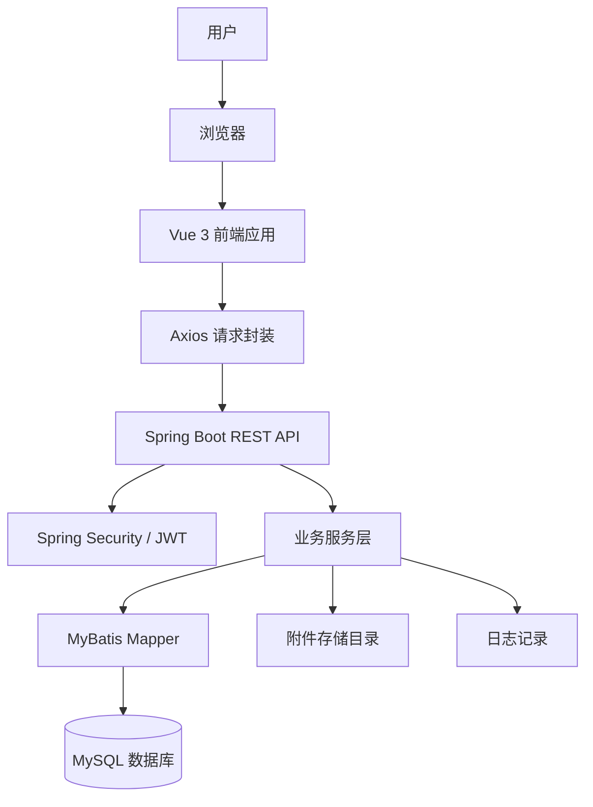
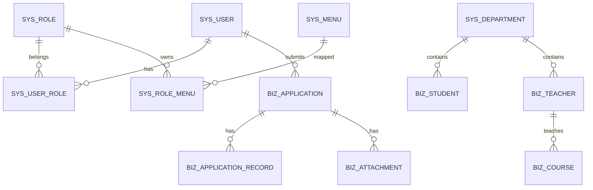

# 高校综合信息管理系统软件说明书

## 基本信息

| 项目 | 内容 |
| --- | --- |
| 项目名称 | 高校综合信息管理系统 |
| 学院 | 计算机学院 |
| 小组序号 | 32 |
| 成员姓名 | 钟磊 / 仇欣皓 / 曹伟 / 罗旭 / 金凡竣 |
| 指导老师 | 尹兆远 |
| 文档类型 | 软件说明书 |
| 当前版本 | 结项版 |
| 提交日期 | 2026年5月16日 |

## 一、项目概述

### 1. 项目背景

高校综合管理中存在大量基础数据、业务数据和过程数据，包括用户账号、角色权限、组织部门、学生档案、教师档案、课程、公告、申请审批、附件和日志等。若继续使用分散文件和人工表格维护，容易造成数据不一致、协作效率低、权限难管控、审批过程不透明等问题。

高校综合信息管理系统以课程实践为背景，围绕高校管理中的通用业务场景，构建一套可运行、可演示、可扩展的 Web 信息系统。系统通过统一登录、权限控制、数据维护、业务流转、附件管理和日志审计，提高信息管理的规范性和可追溯性。

### 2. 系统目标

系统建设目标如下：

- 为管理员和教师用户提供统一登录入口。
- 通过 RBAC 模型实现用户、角色、菜单和按钮权限管理。
- 支持部门、学生、教师等基础信息维护。
- 支持课程、公告、申请等业务数据管理。
- 支持申请流转、审批通过、审批驳回和流转记录查询。
- 支持业务附件上传、下载、删除和联动清理。
- 支持工作台统计、登录日志和操作日志查询。
- 提供清晰的项目结构、接口文档、测试说明和部署说明。

### 3. 开发环境

| 类型 | 内容 |
| --- | --- |
| 操作系统 | Windows + WSL Ubuntu / Ubuntu Server |
| 前端工具 | HBuilder X、VS Code |
| 后端工具 | IntelliJ IDEA 2024.3.2 |
| 前端运行环境 | Node.js、npm |
| 后端运行环境 | JDK 17、Maven |
| 数据库 | MySQL 8.0 |
| 浏览器 | Chrome / Edge 等 Chromium 内核浏览器 |

## 二、需求分析

### 1. 功能需求

系统按照用户角色划分功能入口。管理员负责系统配置和基础数据维护，教师用户主要参与业务查看、申请提交和审批处理，测试人员负责验证系统功能和权限边界。

功能模块如下：

| 模块 | 功能 |
| --- | --- |
| 登录认证 | 登录、退出、当前用户信息、修改密码 |
| 工作台 | 统计卡片、待办事项、业务趋势 |
| 用户管理 | 查询、新增、编辑、删除、状态切换、重置密码、分配角色 |
| 角色管理 | 查询、新增、编辑、删除、状态切换、分配菜单权限 |
| 菜单管理 | 菜单树维护、路由配置、按钮权限码维护 |
| 部门管理 | 部门树查询、新增、编辑、删除、部门下拉 |
| 学生管理 | 查询、新增、编辑、删除、批量删除、导入、导出、创建账号 |
| 教师管理 | 查询、新增、编辑、删除、批量删除、导入、导出、创建账号 |
| 课程管理 | 课程查询、新增、编辑、删除、附件绑定 |
| 公告管理 | 公告查询、新增、编辑、发布、撤回、删除、附件绑定 |
| 申请管理 | 申请查询、新增、编辑、提交、撤回、删除、附件绑定 |
| 工作流 | 待办查询、已办查询、审批通过、审批驳回 |
| 附件管理 | 上传、下载、删除、按业务对象查询 |
| 日志管理 | 登录日志查询、操作日志查询 |

### 2. 业务流程

登录与权限流程：

1. 用户打开系统登录页。
2. 用户输入账号和密码。
3. 后端校验密码和账号状态。
4. 登录成功后返回 JWT、用户信息、角色和权限数据。
5. 前端根据菜单数据渲染导航，根据权限码控制按钮。
6. 后端对受保护接口执行认证和权限校验。

业务申请流程：

1. 用户进入申请管理页面。
2. 用户新建申请并填写申请标题、类型、内容等信息。
3. 用户可上传附件并与申请记录绑定。
4. 用户提交申请，系统生成流转记录。
5. 审批人员在工作流待办中查看申请。
6. 审批人员执行通过或驳回。
7. 系统更新申请状态并保存审批记录。

附件处理流程：

1. 用户在课程、公告或申请页面选择上传附件。
2. 后端保存文件到本地存储目录。
3. 后端写入附件元数据，包括业务类型、业务 ID、原始文件名、存储路径和文件大小。
4. 用户可通过附件列表下载或删除附件。
5. 删除业务记录时，系统同步清理关联附件元数据和文件。

### 3. 非功能需求

| 类型 | 说明 |
| --- | --- |
| 性能要求 | 列表接口分页返回，避免一次性加载大量数据 |
| 安全要求 | 密码加密存储，JWT 认证，后端接口鉴权，关键日志脱敏 |
| 可靠性要求 | 统一异常处理，接口返回结构一致，业务删除需处理关联数据 |
| 易用性要求 | 后台管理界面保持统一表格、表单、弹窗和提示风格 |
| 可维护性要求 | 前后端模块化组织，接口文档和数据库文档同步维护 |
| 可部署性要求 | 支持 Ubuntu 原生部署，前端 dist、后端 jar、MySQL 独立管理 |

## 三、系统设计

### 1. 系统架构

系统采用浏览器、前端应用、后端服务、数据库和附件存储分层架构。



前端采用单页应用模式，使用 Vue Router 管理路由，使用 Pinia 管理登录状态和权限状态。后端采用 Spring Boot 提供 RESTful API，使用 Spring Security 和 JWT 实现认证鉴权，使用 MyBatis XML 访问 MySQL。

### 2. 模块设计

| 模块 | 目录 | 说明 |
| --- | --- | --- |
| 认证模块 | backend/src/main/java/com/xtu/system/modules/auth | 登录、当前用户、菜单权限、修改密码 |
| 系统管理 | backend/src/main/java/com/xtu/system/modules/system | 用户、角色、菜单、日志 |
| 组织管理 | backend/src/main/java/com/xtu/system/modules/organization | 部门管理 |
| 人员管理 | backend/src/main/java/com/xtu/system/modules/personnel | 学生和教师管理 |
| 业务管理 | backend/src/main/java/com/xtu/system/modules/business | 课程、公告、申请 |
| 工作流 | backend/src/main/java/com/xtu/system/modules/workflow | 待办、已办和审批处理 |
| 附件管理 | backend/src/main/java/com/xtu/system/modules/file | 附件上传、下载和删除 |
| 工作台 | backend/src/main/java/com/xtu/system/modules/dashboard | 首页统计数据 |

前端页面目录与业务模块保持对应：

```text
frontend/src/views/
├── dashboard/
├── login/
├── profile/
├── system/
├── organization/
├── personnel/
├── business/
├── workflow/
├── file/
└── exception/
```

### 3. 数据库设计

系统数据库使用 MySQL 8.0，字符集为 `utf8mb4`。主要数据表如下：

| 表名 | 用途 |
| --- | --- |
| sys_user | 用户账号 |
| sys_role | 角色 |
| sys_menu | 菜单和按钮权限 |
| sys_user_role | 用户角色关联 |
| sys_role_menu | 角色菜单关联 |
| sys_department | 部门 |
| biz_student | 学生信息 |
| biz_teacher | 教师信息 |
| biz_course | 课程信息 |
| biz_notice | 公告信息 |
| biz_application | 申请主表 |
| biz_application_record | 申请流转记录 |
| biz_attachment | 附件元数据 |
| sys_login_log | 登录日志 |
| sys_operation_log | 操作日志 |

核心 E-R 关系如下：



## 四、系统实现

### 1. 关键技术

JWT 登录认证：

系统登录成功后由后端生成 JWT，前端在后续请求中通过 `Authorization: Bearer <token>` 携带令牌。后端过滤器解析令牌，获取当前用户信息和权限，用于接口访问控制。

RBAC 权限模型：

系统通过用户、角色、菜单、按钮权限码建立权限模型。用户可分配多个角色，角色可分配多个菜单和按钮权限。前端根据菜单树渲染左侧导航，根据权限码控制按钮显示；后端根据权限码校验接口访问。

MyBatis XML 数据访问：

后端使用 Mapper 接口和 XML 文件分离 SQL，便于维护复杂条件查询、分页查询、关联查询和批量操作。学生、教师、课程、公告、申请等模块均采用统一的 Controller、Service、Mapper 分层结构。

统一响应和异常处理：

后端接口统一返回 `ApiResponse`，分页接口返回 `PageResponse`。参数错误、业务异常、未登录、无权限等情况由统一异常处理器转换为标准 JSON 响应。

前端请求封装：

前端使用 Axios 封装请求实例，统一注入 token，统一处理 401、403、500 等异常状态。业务页面只关注接口调用和页面交互，减少重复代码。

### 2. 界面展示

结项版建议在转换为 docx 或 PDF 时插入以下系统截图：

| 截图文件 | 页面 | 说明 |
| --- | --- | --- |
| docs/report/assets/fig_ui_login.png | 登录页 | 展示系统登录入口和错误提示 |
| docs/report/assets/fig_ui_dashboard.png | 工作台 | 展示统计卡片、待办事项和趋势数据 |
| docs/report/assets/fig_ui_user.png | 用户管理 | 展示用户查询、新增、编辑和角色分配 |
| docs/report/assets/fig_ui_student.png | 学生管理 | 展示学生列表、导入导出和账号创建 |
| docs/report/assets/fig_ui_application.png | 申请管理 | 展示申请提交、附件和审批状态 |
| docs/report/assets/fig_ui_log.png | 日志管理 | 展示登录日志和操作日志 |

Markdown 版保留截图位置说明，提交排版版材料时可将真实截图插入对应章节。

### 3. 核心代码片段

统一响应结构示例：

```java
public class ApiResponse<T> {
    private Integer code;
    private String message;
    private T data;
    private LocalDateTime timestamp;

    public static <T> ApiResponse<T> success(T data) {
        return new ApiResponse<>(200, "操作成功", data, LocalDateTime.now());
    }
}
```

学生分页接口示例：

```java
@GetMapping
public ApiResponse<PageResponse<StudentPageItemVO>> page(StudentQueryRequest request) {
    return ApiResponse.success(studentService.page(request));
}
```

Axios 请求封装示例：

```javascript
request.interceptors.request.use((config) => {
    const token = getToken()
    if (token) {
        config.headers.Authorization = `Bearer ${token}`
    }
    return config
})
```

以上代码体现了项目统一接口返回、模块化业务处理和前端统一鉴权请求的实现方式。

## 五、系统测试

### 1. 测试方案

系统测试覆盖以下范围：

| 测试范围 | 测试内容 |
| --- | --- |
| 登录认证 | 正确账号登录、错误密码提示、token 失效处理 |
| 权限控制 | 管理员和教师账号菜单、按钮、接口权限差异 |
| 系统管理 | 用户、角色、菜单的增删改查和权限分配 |
| 人员管理 | 学生、教师的新增、编辑、导入、导出、删除、账号创建 |
| 业务管理 | 课程、公告、申请的新增、编辑、附件绑定和删除 |
| 工作流 | 申请提交、撤回、审批通过、审批驳回和流转记录 |
| 附件管理 | 上传、下载、删除和业务删除联动清理 |
| 日志管理 | 登录日志、操作日志是否正常写入和查询 |

### 2. 测试结果记录表

| 编号 | 用例 | 操作步骤 | 预期结果 | 结果 |
| --- | --- | --- | --- | --- |
| TC-01 | 管理员登录 | 输入管理员账号和密码 | 登录成功并进入工作台 | 通过 |
| TC-02 | 教师权限 | 使用教师账号登录 | 菜单收敛，系统管理页不可访问 | 通过 |
| TC-03 | 用户管理 | 新增用户、分配角色、切换状态 | 数据保存成功，权限同步生效 | 通过 |
| TC-04 | 学生管理 | 新增学生、导入、导出、批量删除 | 数据正确变化，文件可导出 | 通过 |
| TC-05 | 业务附件 | 新建业务数据并上传附件 | 附件列表显示，文件可下载 | 通过 |
| TC-06 | 申请审批 | 新建申请并提交审批 | 状态变化正确，流转记录完整 | 通过 |
| TC-07 | 删除联动 | 删除绑定附件的业务记录 | 附件元数据和文件同步清理 | 通过 |
| TC-08 | 日志记录 | 登录和执行关键操作 | 登录日志和操作日志有记录 | 通过 |

### 3. 问题与改进

| 问题 | 改进方向 |
| --- | --- |
| 模块数量较多，部分交互容易遗漏 | 建立页面点测清单，逐页验收 |
| 权限控制涉及前后端两侧 | 后端接口鉴权作为最终边界，前端按钮控制作为体验优化 |
| 附件和业务数据存在关联清理 | 删除业务记录时统一调用附件清理服务 |
| 测试依赖数据库状态 | 准备测试库和测试数据初始化脚本 |
| 部署环境和本地环境不同 | 使用环境变量配置数据库、附件路径和 JWT 密钥 |

## 六、用户手册

### 1. 安装部署说明

本地开发环境要求：

- JDK 17。
- Maven。
- Node.js 和 npm。
- MySQL 8.0。

初始化数据库：

```bash
mysql -u root -p
```

启动后端：

```bash
cd backend
DB_USERNAME=root DB_PASSWORD=123456 mvn spring-boot:run
```

启动前端：

```bash
cd frontend
npm install
npm run dev
```

访问地址：

```text
http://localhost:5173
```

生产部署建议：

1. 使用 `npm run build` 构建前端 dist。
2. 使用 `mvn clean package` 构建后端 jar。
3. 使用 Nginx 托管前端静态文件并反向代理 `/api`。
4. 使用 systemd 管理后端服务启停。
5. 使用 MySQL 定期备份数据库。
6. 定期备份附件存储目录。

### 2. 操作指南

登录系统：

1. 打开前端访问地址。
2. 输入账号和密码。
3. 点击登录按钮。
4. 登录成功后进入工作台。

维护用户权限：

1. 进入系统管理中的用户管理。
2. 新增或编辑用户基本信息。
3. 为用户分配角色。
4. 在角色管理中为角色分配菜单和按钮权限。
5. 重新登录后权限生效。

维护学生教师：

1. 进入人员管理中的学生管理或教师管理。
2. 使用查询条件筛选数据。
3. 点击新增或编辑维护人员档案。
4. 可使用导入功能批量录入数据。
5. 可使用导出功能下载当前数据。
6. 可为学生或教师创建登录账号。

处理业务申请：

1. 进入申请管理页面。
2. 新建申请并填写内容。
3. 根据需要上传附件。
4. 提交申请后等待审批。
5. 审批人员进入工作流待办处理。
6. 申请处理完成后可查看流转记录。

查看日志：

1. 进入日志管理页面。
2. 选择登录日志或操作日志。
3. 根据用户名、时间、结果等条件查询。
4. 查看关键操作的 IP、浏览器、请求地址和处理结果。

## 七、项目总结

### 1. 成果总结

本项目围绕高校信息管理场景，完成了前后端分离系统的方案设计、功能开发、数据库设计、接口实现、页面联调、测试验收和部署材料整理。系统形成了登录认证、权限管理、基础数据维护、业务数据处理、附件管理、工作流审批和日志审计等核心模块，满足课程结项演示和说明书提交要求。

### 2. 不足与改进方向

- 工作流当前采用轻量级单节点审批，后续可扩展多级审批、条件分支和流程模板配置。
- 附件当前以本地存储为主，后续可接入对象存储，提高扩展性和可靠性。
- 批量导入已支持基础校验，后续可增加模板下载、错误行标记和导入预览。
- 自动化测试已覆盖核心冒烟链路，后续可继续补充附件、审批异常和数据权限测试。
- 正式服务器部署材料已完成，实际上线时仍需根据服务器域名、端口和安全策略做环境适配。

### 3. 成员分工表

| 成员 | 班级 | 学号 | Git 账号 | 分工 |
| --- | --- | --- | --- | --- |
| 罗旭 | 计算机科学与技术一班 | 202405567009 | jcctkl | 前端开发1，负责登录页、主布局、动态菜单、工作台和个人中心 |
| 曹伟 | 计算机科学与技术一班 | 202405567017 | cw749 | 前端开发2，负责系统管理、人员管理、业务页面和附件交互 |
| 仇欣皓 | 计算机科学与技术一班 | 202405567018 | Agoni18 | 后端开发1，负责认证、权限、用户、角色、菜单、部门和日志 |
| 钟磊 | 计算机科学与技术一班 | 202405567015 | l1160 | 后端开发2和架构设计，负责学生、教师、课程、公告、申请、工作流、附件和数据库脚本 |
| 金凡竣 | 计算机科学与技术一班 | 202405567004 | SitDForget | 测试与文档，负责测试用例、页面回归、部署说明、软件说明书和 Git 过程材料 |

### 4. Git 提交记录

项目采用 GitHub 仓库进行协作。开发过程按照文档、登录认证、系统管理、人员管理、业务管理、附件日志、测试部署等模块拆分提交和合并。结项材料可在本节附上主要提交截图、Pull Request 截图和成员提交记录截图。

## 附录

### 1. 参考资料

- Vue 3 官方文档
- Vite 官方文档
- Element Plus 官方文档
- Spring Boot 官方文档
- Spring Security 官方文档
- MyBatis 官方文档
- MySQL 8.0 官方文档
- Playwright 官方文档

### 2. 源代码仓库链接

```text
https://github.com/l1160/xtu_system
```

### 3. 补充材料

- 项目计划书：`docs/plan/project_plan.md`
- Git 过程说明：`docs/git/git_process.md`
- 数据库设计：`docs/report/数据库设计.md`
- 接口字段说明：`docs/report/接口文档.md`
- 目录和接口清单：`docs/report/项目目录和接口清单.md`
- 测试说明：`tests/README.md`
- 部署说明：`deploy/README.md`
